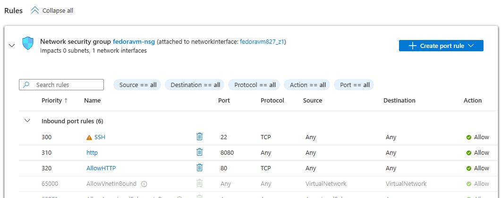

# Azure-Fedora-Community-Deployment

## 1. Project Objective
This project demonstrates the deployment and customization of a **Fedora Cloud VM** using a Community Image in Microsoft Azure. The goal was to overcome marketplace restrictions, configure cloud networking (NSG), and verify a live Nginx web server.

---

## 2. Deployment Details
* **Image:** Fedora-Cloud-40-x64 (Community Gallery)
* **Region:** Canada Central
* **VM Size:** Standard_B2s
* **Public IP:** 130.107.72.238

*Figure 1: Successful provisioning of the Fedora VM in the Azure Portal.*

---

## 3. Networking & Security
Azure Network Security Groups (NSG) were configured to bridge the cloud firewall and allow specific traffic.

* **SSH (Port 22):** Allowed for secure remote administration.
* **HTTP (Port 80):** Allowed for public web access to the Nginx server.

*Figure 2: Inbound Security Rules added to allow HTTP traffic.*

---

## 4. Customization & Verification
I accessed the VM via SSH and performed the following system-level configurations:
1. **dnf upgrade:** Updated all system packages.
2. **nginx install:** Deployed the Nginx web server.
3. **Local Check:** Used `curl -I localhost` to verify the service status internally.

*Figure 3: Combined view showing SSH login success and local 'curl -I localhost' response.*

---

## 5. Challenges Faced
* **Marketplace Restrictions:** Resolved by utilizing the Community Gallery instead of commercial offers.
* **SSH Key Permissions:** Fixed "Permissions too open" error in Windows using `icacls`.
* **OS Firewall:** Identified that this minimal Fedora build lacks `firewalld`, making the Azure NSG the primary security layer.
* **Networking Block:** Fixed a connection timeout by adding a high-priority rule for Port 80.

---

## 6. Final Result
The application is live and accessible via the public internet.

*Figure 4: The final Nginx test page loading successfully in a web browser.*
